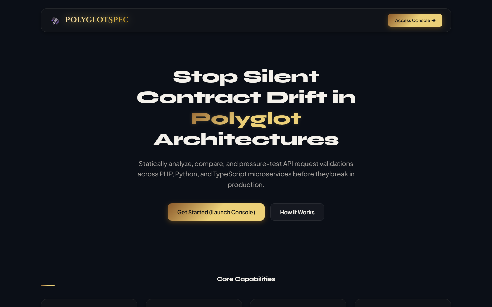

# PolyglotSpec 🚀

Statically detect API contract drift and validation mismatches across multi-language microservices (specifically PHP/Laravel, Python/FastAPI, and TypeScript/Node.js) in your CI/CD pipelines *before* code gets merged.

---

## 🛰️ Visual Developer Console

PolyglotSpec features a premium browser-native developer console with a visual contract diff analyzer, dynamic HTTP boundary fuzzer, and CI/CD configurator:



### Launching the Dashboard Console
The dashboard compiles and runs entirely on your local machine, keeping code, secrets, and fuzzer endpoints fully secure:
```bash
cd dashboard
npm install
npm run dev
```
Open **`http://localhost:5173`** to access the console, toggle quick presets, edit JSON specs, and trigger live HTTP boundary test suites.

---

## The Problem

Modern backend engineering is increasingly polyglot:companies build their user-facing application in one language (like PHP/Laravel or TypeScript/Express) while running machine learning or data pipelines in another (like Python/FastAPI).

The Achilles' heel of this setup is **silent contract drift**. When one team changes an API field name, makes an optional parameter mandatory, or tightens input constraints, nothing catches the bug at build time because the repositories are completely separate. The system crashes only when real users hit staging or production.

## How PolyglotSpec Works

PolyglotSpec reads your source code files statically (without running the application or requiring dependencies) by parsing Abstract Syntax Trees (AST) and validation rule blocks. It then normalizes them to standard JSON Schema (Draft 2020-12) to compare consumer expectations against provider constraints, and can fire boundary fuzzing payloads to verify enforcement.

```
Laravel Source Code               FastAPI Source Code
(FormRequests / Rules)           (Pydantic / Routes)
          │                               │
          ▼                               ▼
    [ AST Parser ]                  [ AST Parser ]
          │                               │
          └───────────────┬───────────────┘
                          │
                          ▼
            [ Universal JSON Schema IR ]
                          │
          ┌───────────────┴───────────────┐
          ▼                               ▼
 [ Drift & Diff Engine ]       [ Adversarial Fuzzer ]
 Flags breaking changes         Generates boundary & edge-case
 in pull requests & CI/CD       payloads with deterministic + SLM tests
```

---

## Key Capabilities

1. **Static AST Extractor**: Extracts validation rules directly from Python Pydantic models, Laravel FormRequests, and TypeScript Zod schemas without executing code.
2. **Canonical Schema Normalizer**: Converts rules into a normalized JSON Schema (Draft 2020-12).
3. **Diff & Drift Classifier**: Compares consumer and provider schemas to flag breaking contract changes (e.g. missing fields, type mismatch, constraint tightening) with detailed error reports.
4. **Adversarial Fuzzer**: Generates boundary payloads (null bytes, numeric overflow, type mutations) and semantic edge cases using local Small Language Models (SLM) or heuristics to stress-test target microservices.

---

## Installation

Install PolyglotSpec in editable mode or from source:

```bash
pip install -e .
```

To run the test suite:

```bash
pip install -e ".[dev]"
pytest
```

---

## Usage

### 1. Check Schema

Statically parse a validation file and output its normalized JSON Schema:

```bash
polyglotspec check path/to/StoreUserRequest.php
polyglotspec check path/to/user_models.py
```

### 2. Diff Contracts (CI/CD PR Blocker)

Compare the consumer schema against the provider schema to check for breaking changes. If breaking drift is detected, the CLI exits with status code `1`, blocking the build pipeline.

```bash
polyglotspec diff path/to/StoreUserRequest.php path/to/user_models.py
```

Example output:
```
❌ Breaking [username]: minLength tightened: Provider requires at least 3 characters, but Consumer permits 2.
❌ Breaking [age]: Type mismatch: Consumer sends '["integer", "null"]', but Provider expects 'integer'.
⚠️ Warning [bio]: Provider removed field 'bio' which is still defined on Consumer.

Contract Drift Summary: 2 breaking changes, 1 warnings.
```

### 3. Fuzz Target Endpoints

Generate fuzzing payloads or run them against a target API endpoint to verify contract enforcement:

```bash
# Print generated boundary & type mutation payloads:
polyglotspec fuzz path/to/user_models.py

# Run them against a target server and report leaks/crashes:
polyglotspec fuzz path/to/user_models.py --target http://localhost:8000/api/users
```

Example output:
```
✔ PASS [Baseline valid payload]: Valid baseline payload accepted as expected.
✔ PASS [Omitted required field: username]: Rejected with expected status 422.
⚠️ LEAK [String maxLength overflow (21/20) in: username]: Vulnerability: Adversarial payload accepted with status 200!
💥 CRASH [Type mutation (bool instead of integer) in: age]: Server crashed with status 500!
```
