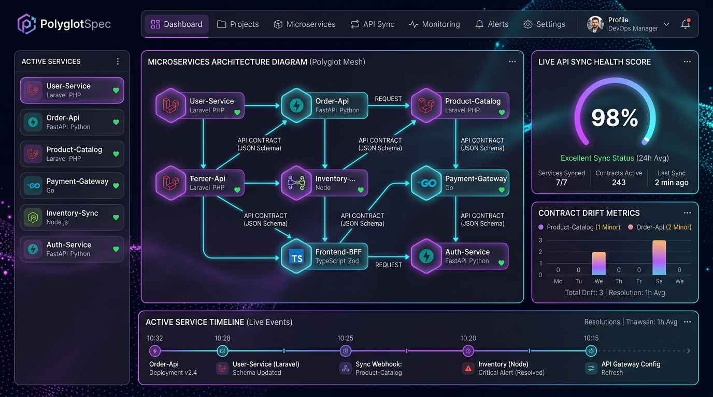
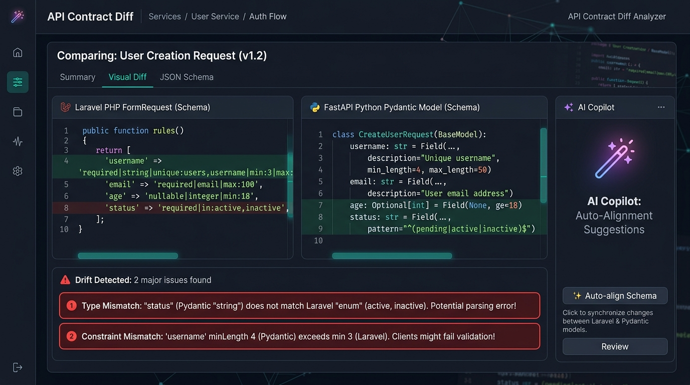
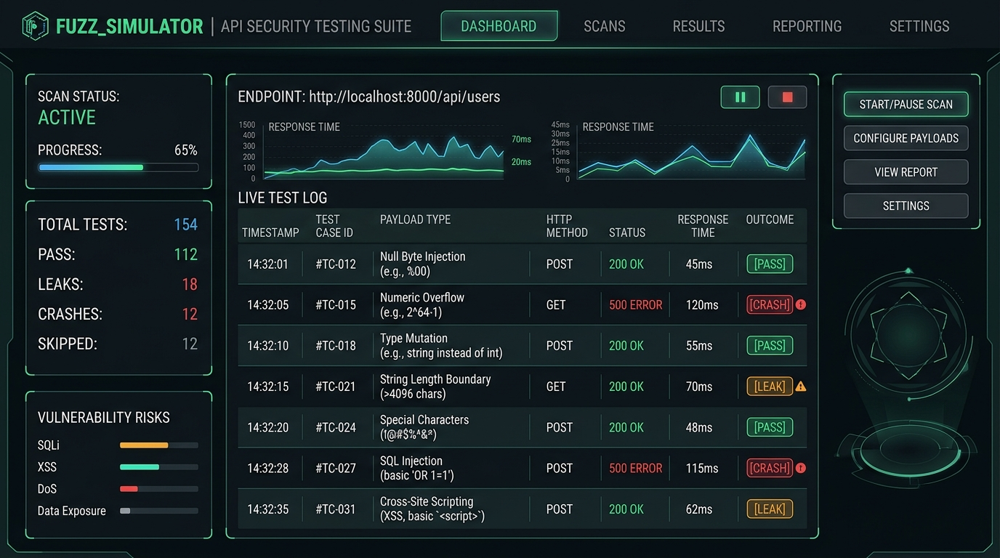
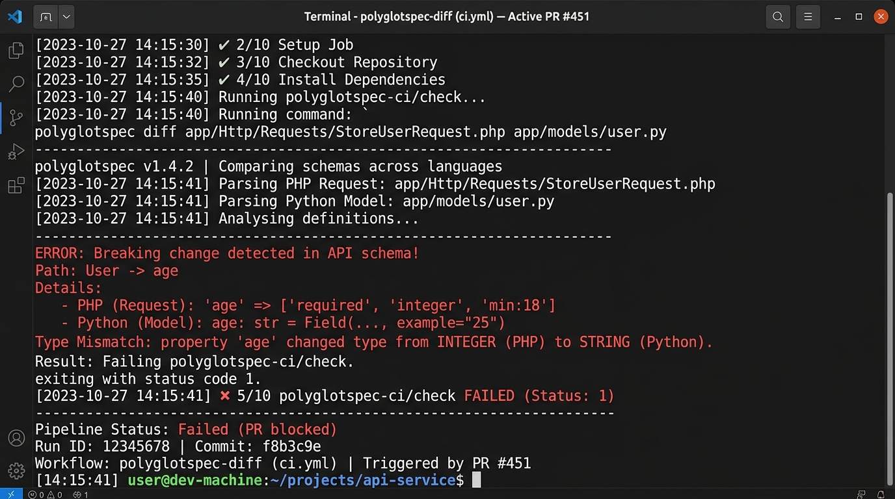

# 🚀 LinkedIn Post (Formatted & Trimmed for LinkedIn 3,000 Character Limit)

---

### 📸 LinkedIn Media Attachments (Add as 4-Image Carousel or Grid)

1. **Photo 1 (Overview Dashboard)**: `docs/images/dashboard_overview.jpg`

2. **Photo 2 (Visual Diff Analyzer & AI Copilot)**: `docs/images/diff_analyzer.jpg`

3. **Photo 3 (Adversarial Fuzz Simulator)**: `docs/images/fuzzer_simulator.jpg`

4. **Photo 4 (CI/CD PR Blocker Output)**: `docs/images/cicd_pipeline.jpg`

---

### 📝 LinkedIn Post Text (Copy & Paste Below)

---

It’s 2 AM on a Friday. Production is down. 🔥

The culprit? Team A deployed a Python microservice update, changing `age` from an optional integer to strictly required. Meanwhile, Team B’s PHP/Laravel API gateway was still sending `null` for new signups.

No compiler caught it. No CI test failed. Why? Because the code lived in separate repositories, written in different languages.

This nightmare inspired me to build **PolyglotSpec** 🚀—a static API contract drift detector & boundary fuzzer for multi-language microservices.

---

### 💡 The Silent Drift Problem

Modern backends are polyglot:
• **Laravel (PHP) / Express (TypeScript)** handle user-facing APIs.
• **FastAPI (Python)** powers AI/ML services and data pipelines.

Validation logic (Laravel `FormRequest`s, Pydantic models, Zod schemas) lives inside code files across repos. When constraints shift in one service, downstream services break silently in production.

---

### 🤔 "Why not just use OpenAPI / Swagger?"

Engineers always ask: *"Why not Swagger?"* Here is why OpenAPI falls short for code-level validation:

1. **Outdated Specs**: OpenAPI docs are secondary. Developers update code rules daily but forget manual Swagger YAMLs.
2. **Runtime Dependency**: Standard OpenAPI tools require spinning up app servers or DB contexts just to export schemas.
3. **No Code-Level AST Diffing**: OpenAPI describes documentation, not live code validation. It can't compare a `.php` file against a `.py` model in Git PRs statically.
4. **No Automated CI PR Blocking**: Swagger specs don't automatically diff consumer expectations vs provider rules in CI pipelines to block bad merges.

---

### 🛡️ How PolyglotSpec Solves It

PolyglotSpec works statically at the AST (Abstract Syntax Tree) level with **ZERO code execution**:

1. 🔍 **Static AST Extractor**: Inspects validation rules directly from PHP (`FormRequest`), Python (`Pydantic`), and TypeScript (`Zod`) source files.
2. 🔄 **Canonical Schema IR**: Normalizes language-specific rules into standard JSON Schema (Draft 2020-12).
3. ⚡ **CI/CD PR Blocker**: Runs `polyglotspec diff consumer.php provider.py` in GitHub Actions / GitLab CI. If breaking drift occurs, it exits with status `1` and blocks the PR before merging.
4. 💣 **Adversarial Fuzzer**: Automatically generates edge-case & type mutation payloads to stress-test live endpoints.
5. 🪄 **Local AI Copilot & Dashboard**: Powered by local Ollama (`llama3`) or built-in SLM logic to explain drift risks & provide 1-click fixes in a browser console.

---

### 🛠️ Open Source & Ready to Use

PolyglotSpec is built with Python 3.10+, React, and Vite, and is 100% open source.

⭐ Check out the GitHub repo and let me know your thoughts in the comments! 👇

🔗 **GitHub Repository**: https://github.com/ArafathUIU/PolyglotSpec

#SoftwareEngineering #Microservices #Python #FastAPI #Laravel #PHP #TypeScript #OpenSource #DevOps #CICD #SystemDesign
